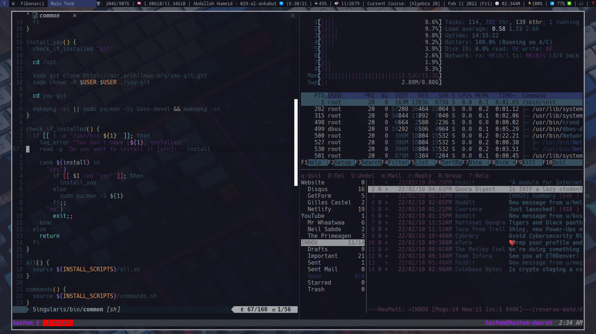
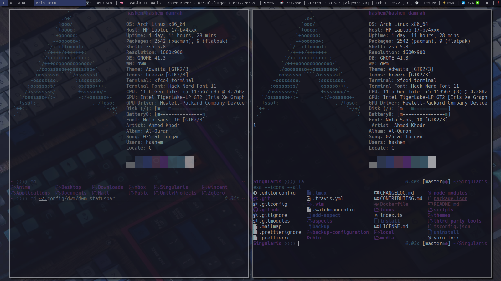
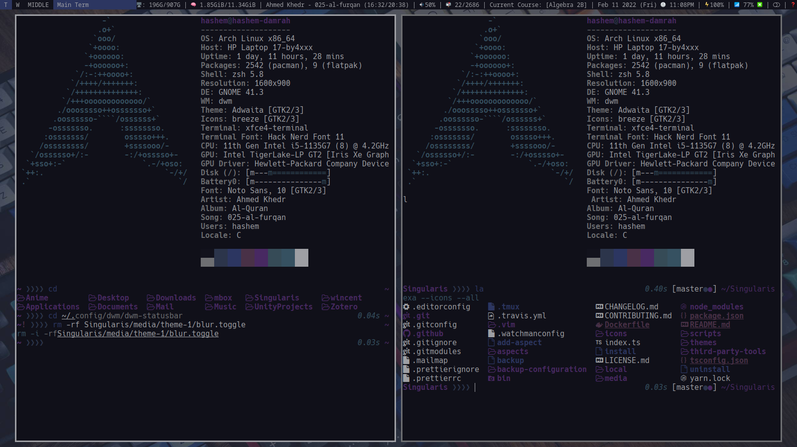
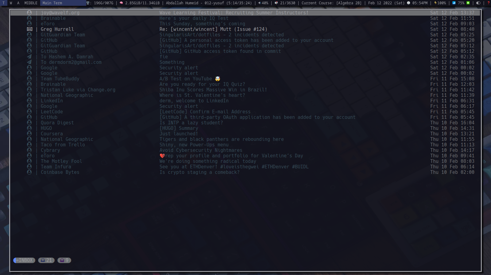
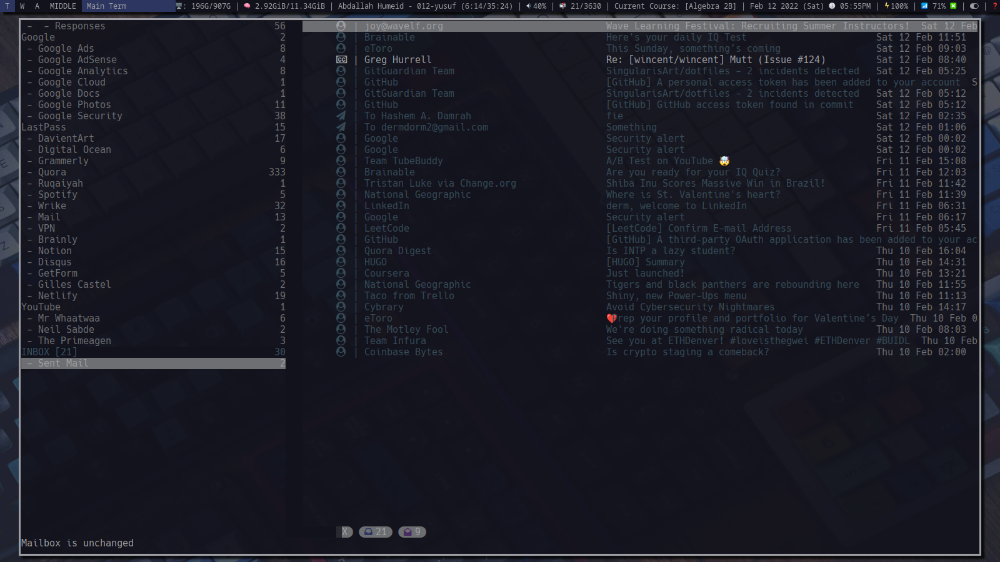
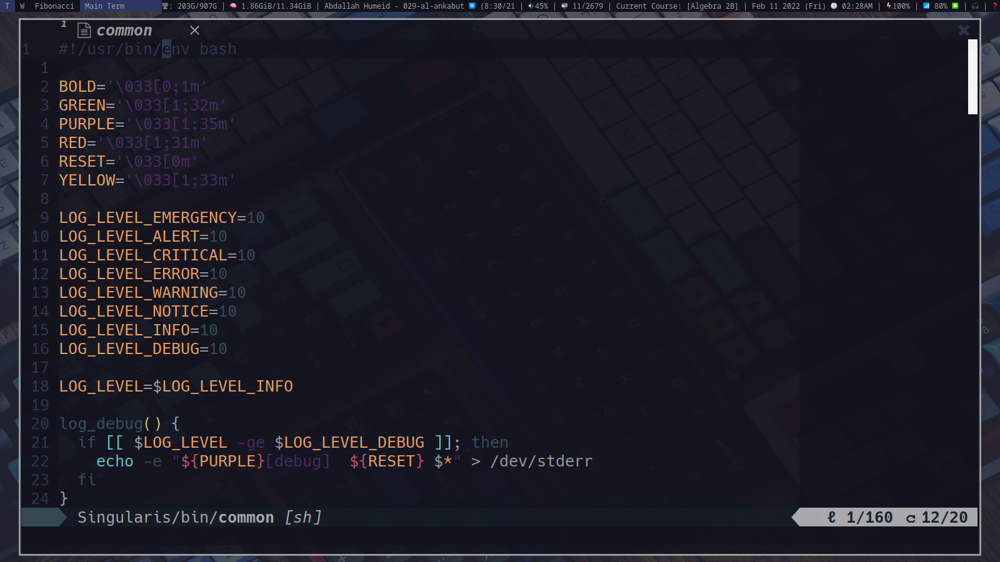

"dotfiles" and my system configuration
======================================

# Gallery

## System

<details><summary>Zsh</summary>
    <p>
        
    </p>
</details>

<details><summary>Tmux</summary>
    <p>
        
    </p>
</details>

<details><summary>Dunst</summary>
    <p>
        
    </p>
</details>

<details><summary>Rofi</summary>
    <p>
        
    </p>
</details>

<details><summary>Xmenu</summary>
    <p>
        
    </p>
</details>

<details><summary>Picom</summary>
    <p>
        
        
    </p>
</details>

## Communication

<details><summary>Neomutt</summary>
    <p>
        
        
    </p>
</details>

## Development

<details><summary>Neovim</summary>
    <p>
        
    </p>
</details>

<details><summary>GnuPlot</summary>
    <p>
        
    </p>
</details>

<details><summary>Matplotlib</summary>
    <p>
        
    </p>
</details>

<details><summary>Notes</summary>
    <p>
        
    </p>
</details>

## Utility

<details><summary>Monitors</summary>
    <p>
        
    </p>
</details>

<details><summary>PDF's</summary>
    <p>
        
    </p>
</details>

<details><summary>Files</summary>
    <p>
        
    </p>
</details>

<details><summary>Volume</summary>
    <p>
        
    </p>
</details>

<details><summary>Calendar</summary>
    <p>
        
    </p>
</details>

## Entertainment

<details><summary>Audio</summary>
    <p>
        
    </p>
</details>

<details><summary>News</summary>
    <p>
        
    </p>
</details>

<details><summary>Misc</summary>
    <p>
        
    </p>
</details>

<details><summary>Images</summary>
    <p>
        
    </p>
</details>

Table of Contents
=================

* ["dotfiles" and my system configuration](#dotfiles-and-my-system-configuration)
* [Gallery](#gallery)
   * [System](#system)
   * [Communication](#communication)
   * [Development](#development)
   * [Utility](#utility)
   * [Entertainment](#entertainment)
* [Table of Contents](#table-of-contents)
* [Dotfiles](#dotfiles)
   * [Mutt](#mutt)
      * [Accounts](#accounts)
      * [Bindings](#bindings)
         * [Index](#index)
         * [Navigation](#navigation)
         * [Pager](#pager)
            * [Compose](#compose)
         * [Sidebar](#sidebar)
   * [Zsh](#zsh)
      * [Functions](#functions)
      * [Prompt](#prompt)
   * [Tmux](#tmux)
      * [Bindings](#bindings-1)
* [Window Managers](#window-managers-1)
   * [DWM](#dwm)
      * [Shortcuts](#shortcuts)
         * [Basics](#basics)
         * [Gaps](#gaps)
         * [Layouts](#layouts)
         * [Applications](#applications)
         * [Audio](#audio)
         * [School](#school)
      * [Tags](#tags)
* [Dependencies](#dependencies)
   * [Platform status](#platform-status)
   * [Installation](#installation)
      * [Backup](#backup)
         * [Examples](#examples)
      * [Install](#install)
         * [Examples](#examples-1)
      * [Uninstall](#uninstall)
         * [Examples](#examples-2)
   * [License](#license)
* [Credit](#credit)

# Dotfiles

[A set of dotfiles](aspects) that I’ve been tweaking and twiddling since mid
2018 ([under version
control](https://github.com/SingularisArt/Singularis/commit/7b3b20e) since
2021). Characteristics include:

* Sane Vim pasting via bracketed paste mode.
* Full mouse support (pane/split resizing, scrolling, text selection) in Vim
  and tmux.
* Focus/lost events for Vim inside tmux.
* Cursor shape toggles on entering Vim.
* Italics in the terminal.
* Bundles a (not-excessive) number of useful Vim plug-ins.
* Conservative Vim configuration (very few overrides of core functionality;
  most changes are unobtrusive enhancements; some additional functionality
  exposed via <Leader> and <LocalLeader> mappings.
* Relatively restrained Zsh config, Bash-like but with a few Zsh perks, such as
  right-side prompt, auto-cd hooks, command elapsed time printing, own
  custom-made plugin manager, and such.

## Mutt

### Accounts

Now, I'm a programmer. And, as a programmer, I'm lazy. I don't like to do work,
if that work is already done. So, instead of making an easy way for creating
accounts, I just use [mutt-wizard](https://github.com/LukeSmithxyz/mutt-wizard/)
(which was created by [Luke Smith](https://github.com/LukeSmithxyz).

So, to create an account, all you have to do is type:

`mw -a your@email.com`

Then, give it your information. To edit your account configuration, go to
`~/.config/mutt/`. There, you can configure as you please.

### Bindings

#### Index

| Icon  | Meaning                                                           |
| ----- | ----------------------------------------------------------------- |
|      | Email not addressed to me.                                        |
|      | I am only recipient.                                              |
|      | I am not the only recipient.                                      |
|      | I was CCd, but not the only recipient.                            |
|      | Message sent by me.                                               |
|      | My address in Reply To:, but none of the above apply.             |
|      | The mail is signed, and the signature is successfully verified.   |
|      | The mail is PGP encrypted.                                        |
|      | The mail is signed.                                               |
|      | The mail contains a PGP public key.                               |
|      | The mail is tagged.                                               |
|      | The mail is flagged as important.                                 |
|      | The mail is marked for deletion.                                  |
|      | The mail has attachments marked for deletion.                     |
|      | The mail has been replied to.                                     |
|      | The mail has been read.                                           |

#### Navigation

| Keybind       | Function                                                  |
| ---------     | --------------------------------------------------------- |
| G             | Go to last entry.                                         |
| gg            | Go to first entry.                                        |
| d             | Page down.                                                |
| u             | Page up.                                                  |
| D             | Delete message.                                           |
| Ctrl+d        | Delete thread.                                            |
| Ctrl+r        | Mark thread read.                                         |
| U             | Undelete message.                                         |
| L             | Limit/Filter.                                             |
| Enter, l      | Open message.                                             |
| R             | Group reply.                                              |
| r             | Reply.                                                    |
| f             | Forward message.                                          |
| m             | New message.                                              |
| v             | View attachments.                                         |
| @             | Compose to Sender.                                        |
| Esc+e         | Resend message Esc.                                       |
| s             | Save message (to file).                                   |
| Space, Esc+v  | Toggle collapse thread                                    |
| Esc+v         | Toggle collapse all threads.                              |
| A             | Add contact to Khard.                                     |
| P             | Jump to parent message.                                   |
| Esc+k         | Email PGP public key.                                     |

#### Pager

| Keybind   | Function                                                      |
| --------- | ------------------------------------------------------------- |
| G         | Bottom of page.                                               |
| gg        | Top of page.                                                  |
| j         | Next line.                                                    |
| k         | Previous line.                                                |
| l         | View attachments.                                             |
| d         | Page down.                                                    |
| u         | Page up.                                                      |
| R, g      | Group reply.                                                  |
| r         | Reply.                                                        |
| @         | Compose to Sender.                                            |
| Ctrl+d    | Delete thread.                                                |
| Ctrl+r    | Mark thread read.                                             |
| N         | Mark thread new.                                              |

##### Compose

| Keybind   | Function                                                      |
| --------- | ------------------------------------------------------------- |
| Ctrl+O    | Rename attachment.                                            |
| Esc+k     | Attach PGP public key.                                        |
| A         | Attach message.                                               |
| P         | Postpone message.                                             |
| a         | Attach files.                                                 |
| i         | Run spellcheck (ispell).                                      |
| o         | Show autocrypt menu options.                                  |
| p         | PGP menu.                                                     |
| y         | Send message.                                                 |

#### Sidebar

| Keybind   | Function                                                      |
| --------- | ------------------------------------------------------------- |
| B         | Show sidebar.                                                 |
| Ctrl+k    | Up.                                                           |
| Ctrl+j    | Down.                                                         |
| Ctrl+o    | Open.                                                         |
| Ctrl+n    | Open next new.                                                |
| Ctrl+p    | Open previous new.                                            |

## Zsh

### Functions

* `ag`: Transparently wraps the `ag` executable so as to provide a centralized
  place to set defaults for that command (seeing as it has no "rc" file).

* `color`: Change terminal and Neovim color scheme.

* `fd`: Using fast `bfs` and `sk`; automatically `cd`s into the selected
  directory.

* `fh`: Selecting a history item inserts it into the command line but does not
  execute it.

* `history`: Overrides the (tiny) default history count.

* `jump`: To jump to hashed directories.

* `regmv`: Bulk-rename files (eg. `regmv '/\.tif$/.tiff/' *`).

* `scratch`: Create a random temporary scratch directory and `cd` into it.

* `tick`: Moves an existing time warp (eg. `tick +1h`); see `tw` below for a
  description of time warp.

* `tmux`: Wrapper that reattaches to pre-existing sessions, or creates new ones
  based on the current directory name; additionally, looks for a `.tmux` file
  to set up windows and panes (note that the first time a given `.tmux` file is
  encountered the wrapper asks the user whether to trust or skip it).

* `tw`: Overrides `GIT_AUTHOR_DATE` and `GIT_COMMITTER_DATE` (eg. `tw -1d`).

* `gpg`: Just a re-write function that if you don't give it any parameters, it
  will run `gpg --list-keys`.

* `zsh_add_file`: This function sources any file you have in the zsh config
  directory in ~/Singularis/aspects/dotfiles/files/.zsh

* `zsh_add_plugin`: This function sources any plugin you have in the zsh config
  directory in ~/Singularis/aspects/dotfiles/files/.zsh/plugins

* `zsh_add_completion`: This function sources any completion you have in the
  zsh config directory in ~/Singularis/aspects/dotfiles/files/.zsh/completion

### Prompt

## Tmux

### Bindings

# Window Managers

## DWM

### Shortcuts

#### Basics

| Keypresses               | Action                                            | Needed packages       | Install needed packages                |
| -----------------------  | ------------------------------------------------- | --------------------- | -------------------------------------- |
| WindowsKey + w           | Spawn google chrome                               | Google Chrome         | `yay -S google-chrome`                 |
| WindowsKey + F1          | Open the master.pdf                               | Zathura               | `sudo pacman -Sy zathura`              |
| WindowsKey + BackSpace   | Gives you options to log out, shut down, etc      | NONE                  | `NONE`                                 |
| WindowsKey + Shift + d   | Spawns Xmenu                                      | Xmenu                 | `~/.config/xmenu && sudo make install` |
| WindowsKey + Shift + e   | Spawns rofi emoji selector                        | Rofi Emoji Selector   | `NONE`                                 |
| WindowsKey + Shift + q   | Exits DWM                                         | NONE                  | `NONE`                                 |
| WindowsKey + d           | Spawns rofi                                       | Rofi                  | `sudo pacman -Sy rofi`                 |
| WindowsKey + q           | Closes current window                             | NONE                  | `NONE`                                 |
| WindowsKey + s           | Makes current window sticky                       | NONE                  | `NONE`                                 |
| WindowsKey + f           | Makes current window full screen                  | NONE                  | `NONE`                                 |
| WindowsKey + h           | Increases size to the right                       | NONE                  | `NONE`                                 |
| WindowsKey + l           | Increases size to the left                        | NONE                  | `NONE`                                 |
| WindowsKey + k           | Jump between windows                              | NONE                  | `NONE`                                 |
| WindowsKey + j           | Jump between windows                              | NONE                  | `NONE`                                 |

#### Gaps

| Keypresses              | Action                               | Needed packages   | Install needed packages     |
| ----------------------- | ------------------------------------ | ----------------- | --------------------------- |
| WindowsKey + a          | Toggles gaps on and off              | NONE              | `NONE`                      |
| WindowsKey + z          | Increases gaps size                  | NONE              | `NONE`                      |
| WindowsKey + x          | Decreases gaps size                  | NONE              | `NONE`                      |
| WindowsKey + b          | Toggle topbar                        | NONE              | `NONE`                      |

#### Layouts

| Keypresses              | Action                               | Needed packages   | Install needed packages     |
| ----------------------- | ------------------------------------ | ----------------- | --------------------------- |
| WindowsKey + t          | Open master in the middle mode       | NONE              | `NONE`                      |
| WindowsKey + y          | Open master on the right side mode   | NONE              | `NONE`                      |
| WindowsKey + u          | Open spiral mode                     | NONE              | `NONE`                      |
| WindowsKey + i          | No layout                            | NONE              | `NONE`                      |

#### Applications

| Keypresses              | Action                               | Needed packages   | Install needed packages                |
| ----------------------- | ------------------------------------ | ----------------- | ---------------------------            |
| WindowsKey + n          | nvim                                 | `NeoVim`          | `sudo pacman -Sy nvim`                 |
| WindowsKey + m          | neomutt                              | `NeoMutt`         | `sudo pacman -Sy neomutt`              |
| WindowsKey + e          | ncmpcpp                              | `NCMPCPP`         | `sudo pacman -Sy ncmpcpp`              |
| WindowsKey + c          | calcurse                             | `Calcurse`        | `sudo pacman -Sy calcurse`             |
| WindowsKey + Shift + k  | kmon                                 | `Kmon`            | `cargo install kmon`                   |
| WindowsKey + Shift + y  | ytop                                 | `Ytop`            | `cargo install ytop`                   |
| WindowsKey + Shift + p  | pavucontrol                          | `Pavucontrol`     | `sudo pacman -Sy pavucontrol`          |
| WindowsKey + Shift + b  | bashtop                              | `Bashtop`         | `sudo pacman -Sy bashtop`              |
| WindowsKey + Shift + w  | newsboat                             | `Newsboat`        | `sudo pacman -Sy newsboat`             |
| WindowsKey + Shift + r  | htop                                 | `Htop`            | `sudo pacman -Sy htop`                 |
| WindowsKey + Shift + d  | xmenu                                | `Xmenu`           | `~/.config/xmenu && sudo make install` |
| WindowsKey + Shift + s  | tdrop                                | `Tdrop`           | `cargo install tdrop`                  |

#### Audio

| Keypresses                    | Action                               | Needed packages   | Install needed packages     |
| ----------------------------- | ------------------------------------ | ----------------- | --------------------------- |
| WindowsKey + Alt + t          | mpc toggle                           | `Mpc`             | `sudo pacman -Sy mpc`       |
| WindowsKey + Alt + r          | mpc seek 0                           | `Mpc`             | `sudo pacman -Sy mpc`       |
| WindowsKey + Alt + Shift + [  | mpc seek +60                         | `Mpc`             | `sudo pacman -Sy mpc`       |
| WindowsKey + Alt + Shift + ]  | mpc seek -60                         | `Mpc`             | `sudo pacman -Sy mpc`       |
| WindowsKey + Alt + [          | mpc seek +10                         | `Mpc`             | `sudo pacman -Sy mpc`       |
| WindowsKey + Alt + ]          | mpc seek -10                         | `Mpc`             | `sudo pacman -Sy mpc`       |
| WindowsKey + Alt + ,          | mpc prev                             | `Mpc`             | `sudo pacman -Sy mpc`       |
| WindowsKey + Alt + .          | mpc next                             | `Mpc`             | `sudo pacman -Sy mpc`       |
| WindowsKey + Alt + u          | Increase audio by 5                  | `Pamixer`         | `sudo pacman -Sy pamixer`   |
| WindowsKey + Alt + d          | Decrease audio by 5                  | `Pamixer`         | `sudo pacman -Sy pamixer`   |

#### School

| Keypresses              | Action                               | Needed packages   | Install needed packages     |
| ----------------------- | ------------------------------------ | ----------------- | --------------------------- |
| WindowsKey + Alt + c    | Run `rofi-current-course.py`         | `NONE`            | `NONE`                      |
| WindowsKey + Alt + l    | Run `rofi-lessons.py`                | `NONE`            | `NONE`                      |
| WindowsKey + Alt + g    | Run `rofi-grades.py`                 | `NONE`            | `NONE`                      |
| WindowsKey + Alt + e    | Run `rofi-new-lesson.py`             | `NONE`            | `NONE`                      |
| WindowsKey + Alt + p    | Run `rofi-commands.py`               | `NONE`            | `NONE`                      |
| WindowsKey + Alt + y    | Run `rofi-yaml.sh`                   | `NONE`            | `NONE`                      |
| WindowsKey + Alt + n    | Run `rofi-nvim.sh`                   | `NONE`            | `NONE`                      |
| WindowsKey + Alt + s    | Run `rofi-source-code.sh`            | `NONE`            | `NONE`                      |
| WindowsKey + Alt + w    | Run `rofi-web-browser.sh`            | `NONE`            | `NONE`                      |
| WindowsKey + Alt + f    | Run `rofi-file-browser.sh`           | `NONE`            | `NONE`                      |
| WindowsKey + Alt + i    | Run `rofi-inkscape.sh`               | `NONE`            | `NONE`                      |
| WindowsKey + Alt + z    | Run `rofi-zathura.sh`                | `NONE`            | `NONE`                      |
| WindowsKey + Alt + o    | Run `rofi-compile.sh`                | `NONE`            | `NONE`                      |

### Tags

I made my tags each have one uppercase letter to indicate what that tag is used
for (You can customize this [here](aspects/dwm/dwm-config/config.h).):

* Here are my tags:
  * `T`: Terminal.
  * `W`: Web.
  * `F`: Files.
  * `B`: Books.
  * `P`: Pdf's.
  * `A`: Audio.
  * `E`: Email.
  * `S`: Slack.
  * `C`: Config.

# Dependencies

All you need is `git` installed.

> **NOTE:** If you don't have the **PACMAN** package manager, then you need to
> look at the [packages](scripts/install/packages.txt) and install the needed
> packages. If you do have the **PACMAN** package manager, then the install
> script will install all the needed packages for you.

## Platform status

| Platform             | Status                                                                                                                                                                      |
| -------------------- | --------------------------------------------------------------------------------------------------------------------------------------------------------------------------- |
| Arch Linux           | :1st_place_medal: Most tested, Arch Linux is one of my main OS. You get the most aspects if you are on Linux.                                                               |
| MacOS                | :2nd_place_medal: Not as bad, but it can have some bugs here and there, but it's up to you to fix those because I don't use mac and won't really be fixing any bugs for it. |
| Windows              | :3rd_place_medal: The worst rank. Not tested at all. I don't even have an install script for it. So, you shouldn't use windows when using my dotfiles.                      |
| Other                | :3rd_place_medal: Just like Windows. Not tested at all, and probably will never be tested.                                                                                  |

## Installation

```sh
git clone --recursive https://github.com/SingularisArt/Singularis.git
```

### Backup

Before you install all of my [aspects](aspects), you may want to backup your
configuration. Here's how you do it:

#### Examples

```bash
./backup                    # This will backup all of your configuration and move it to ~/Singularis/backup-configuration
./backup nvim               # This will backup only your neovim configuration to ~/Singularis/backup-configuration
./backup nvim xfce3         # This will backup only your neovim and xfce4 configuration to ~/Singularis/backup-configuration
./backup --help             # Shows the help menu
```

### Install

It's quit easy to install my configuration. I spent countless hours working on
the perfect script. And, well, here it is.

#### Examples

```sh
./install --all             # Installs everything
./install dotfiles          # Installs only my dotfiles configuration
./install awesome           # Installs only my awesome configuration
./install awesome dotfiles  # Installs only my awesome configuration and dotfiles in that order
./install --commands        # That will show you all of the possible commands
```

### Uninstall

To **UNINSTALL** my configuration, you first must backup your configuration. (Take a look [here](#backup) to see how you do that.)

#### Examples

```bash
./uninstall                 # Moves all of the items from ~/Singularis/backup-configuration to ~/.config/
./uninstall nvim            # Moves only the neovim configuration from ~/Singularis/backup-configuration to ~/.config/
```

## License

Unless otherwise noted, the contents of this repo are in the public domain. See
the [LICENSE](LICENSE.md) for details.

# Credit

* [Greg Hurrell](https://github.com/wincent)
* [Luke Smith](https://github.com/LukeSmithxyz)
* [Chris at Machine](https://github.com/ChristianChiarulli)
* [Lcpz](https://github.com/lcpz/awesome-copycats)
* [Gideon Wolfe](https://github.com/GideonWolfe)
